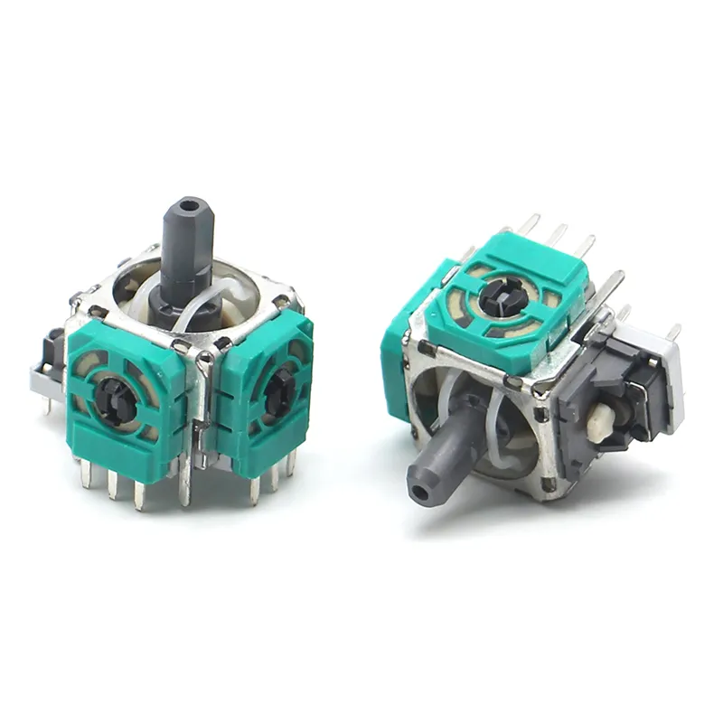
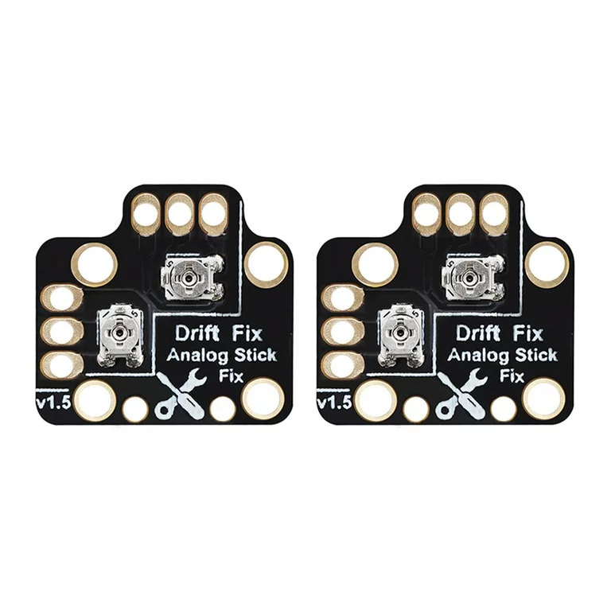

# Joystick Repair

<figure><figcaption>
Fig. JRA
</figcaption></figure>

Any controllers most common issue found is stick drift or an issue with the stick module (Fig JRA). It is the most interacted with part of the controller, as well as the most delicate. Due to this, these must be replaced quite often and require some basic soldering/hot-air skills to replace.&#x20;

We often need to use external calibration flex boards for replacement sticks if they do not perform as intended after replacement (Fig. JRB).

<figure><figcaption>
Fig. JRB
</figcaption></figure>

### Step 1: Preparing the board for de-soldering

1. Secure the board in place using the helper arms to ensure stability.
2. Ensure adequate lighting is available for proper visibility.
3. Position the fume extractor near the board, ensuring it is both convenient and safely away from potential heat sources.


Put on safety glasses, as molten solder or plastics can flick off a board and damage your eyes.


4. Apply flux to the pads of the joystick.
5. Set the hot air station temperature to 300°C-350°C and fan speed to moderate.


Avoid touching the metal nozzle during operation or within 10 minutes after powering on, as it can reach temperatures exceeding 900°F.


### Step 3: Desoldering and removing the defective joystick

#### Removing solder from single pad.

Begin by placing the soldering iron tip at the first contact. When the solder is shiny, take your [solder sucker](../tools/repair-tools.md#solder-sucker) and prime it (lever down til it clicks) and then press the tip to the contact point to create as best a seal we can make, then press the button. We must do this relatively quickly because there is a lot of heat used in this process. If done correctly, they solder will suck up into the solder sucker, and the pad will be freed of some solder.&#x20;

You will need to clear the solder out by pressing all the way down until the metal pole ejects the solder collected from the tip. This is done to clear the airway for the next solder joint.&#x20;

Repeat this process on all the legs of the joystick until you have removed as much solder as possible on each of the pads.

#### Removing the module

Point the hot air gun at the contact points of the joystick and heat up the entire area evenly. Hold around 1-2 inches away from the board.


Exercise caution around small components near the joystick contacts to prevent damage.


When you look at the solder before its heated properly, it will be lightly matte, when it heats to the proper temperature to melt, it will turn very shiny and begin to flow like a heavy liquid.

Eventually the solder will likely smoke and begin to go towards the fume extractor. Do not breathe in this smoke or let it touch your eyes excessively.&#x20;

Then continue working the heat around the area, gently pulling the stick up off the board with tweezers or pliers until the joystick is free. You will likely have to move the hot air around to focus areas where solder is still sticking and not liquid. If you find that the circular pads around the joints are becoming damaged or pulling up from the suction, your air gun is too hot and you will need to adjust the temperature. This also applies with the solder iron.

### Step 4: Prepping the board for the new stick

Now that the old stick has been removed, we must prepare the area for the new joystick. To do this we must ensure 3 things in this order:

1. There is no solder in the mounting holes.
2. The work area is cleaned
3. The pads are healthy

For the first step, we need to make sure there is no solder in the mounting holes to ensure the joystick sits flush with the board and is properly connected to the rear board. When flux is becoming ‘dead’ it will begin to turn brown and then eventually black where it becomes unusable. If this is occurring, remove the previous flux. If not, add more flux to the holes with solder still and apply heat with the hot air gun until it shines and then use the solder pump.

Before we apply flux for the joystick, we need to remove the old flux from the previous job, as it will begin to burn when activated too long. Simply run a q tip and brush with alcohol in the area, being mindful of small components. Once this is done and the area is free of solder and old flux, we can almost mount the new joystick.

Lastly, we need to look at the solder holes and ensure there is no physical damage.

Around each hole there should be metallic material around the hole, which is what the new solder will bond too. If it is dark, even brown in color, even after cleaning, it is likely the pad got damaged, too hot, or both and was torn off from the motherboard. It is also possible the metal around the area is raised from the board, this is a raised pad and it considered pulled. Although it might work now, if we solder to a pad that is raised, it will likely be brittle and damage from regular use quickly. Assuming the area is now free of old solder, has been cleaned, and verified there is no damage significant enough to the pads to continue, we will now install the joystick.

### Step 5: Soldering the new joystick
