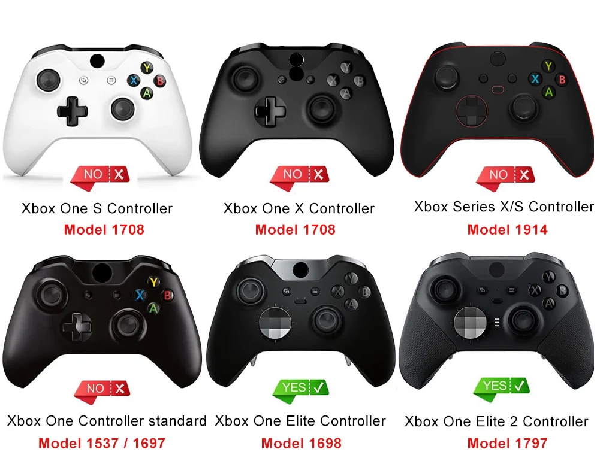

# Xbox One Controllers

## Information

The Xbox One controller comes in several models, but all will essentially be the same with some minor differences in shell design as well as layout of the controller. The principles of this can be condensed into one guide going over a full disassembly (with reassembly tips) and what to watch out for as well as hints and tips to understand how this controller is assembled and disassembled.

## Recommended Tools

* Disassembly
  * Straight Pry Tool
  * T6 + T8 Screwdriver Bits
  * Screwdriver
  * Soldering Iron
  * Solder
  * Precision Tweezers (straight or 30/40)
* Repairing
  * Flux
  * Tweezers
  * Soldering Helping Hands
* Cleaning
  * QTips/Brushes
  * Magic Eraser
  * Cleaning Disinfectant
  * Microfiber Cloth

## Controller Models

<figure><figcaption></figcaption></figure>

*
