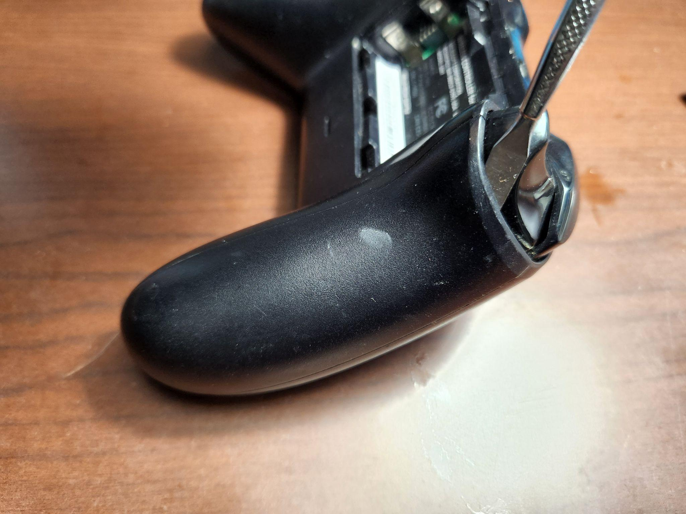
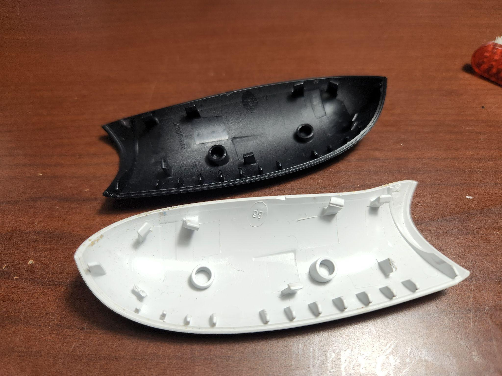
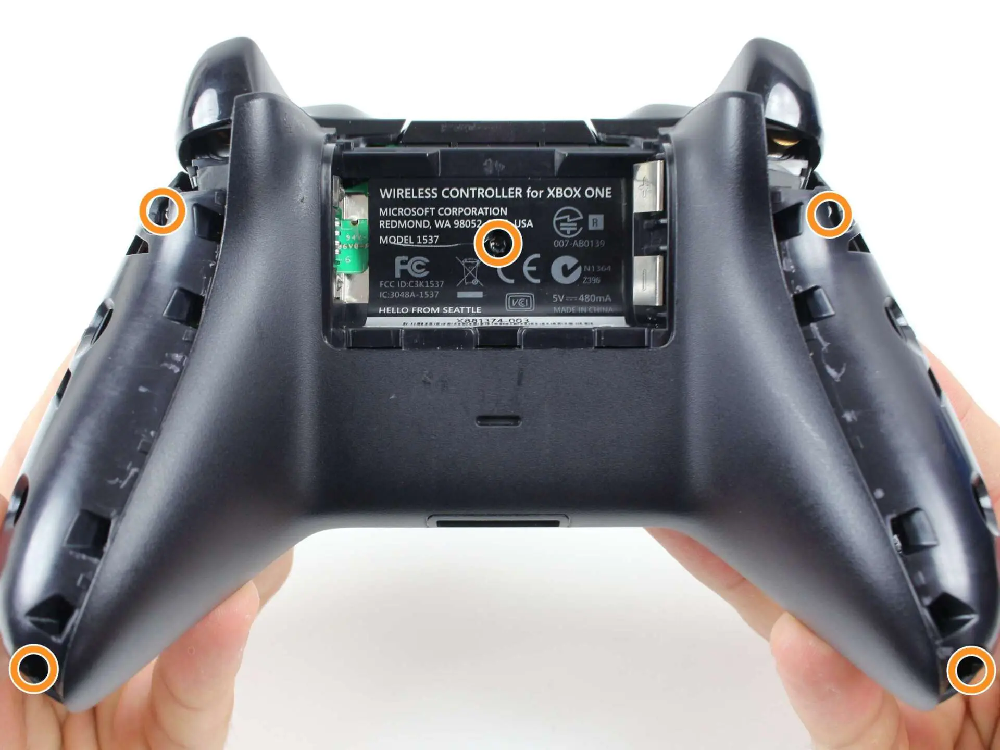
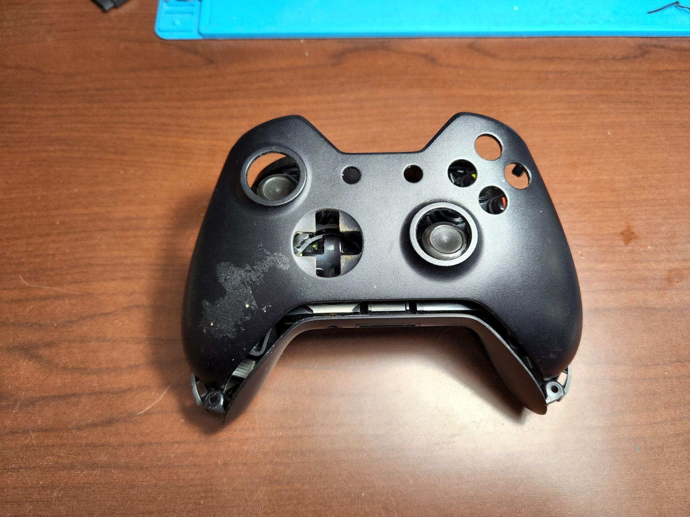
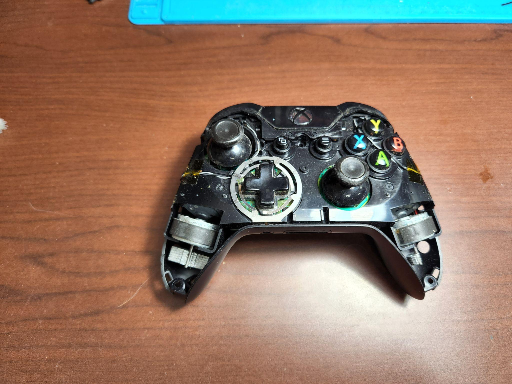
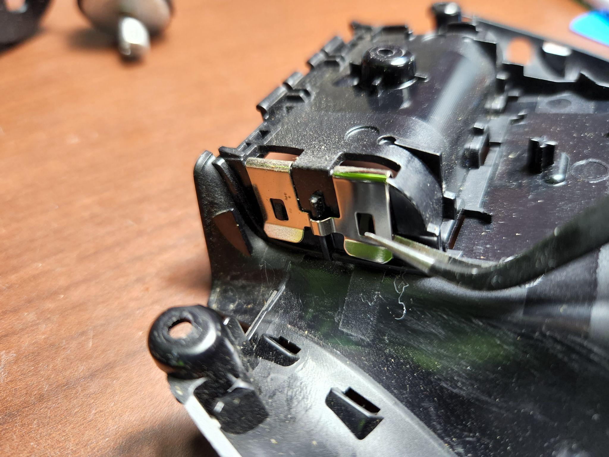
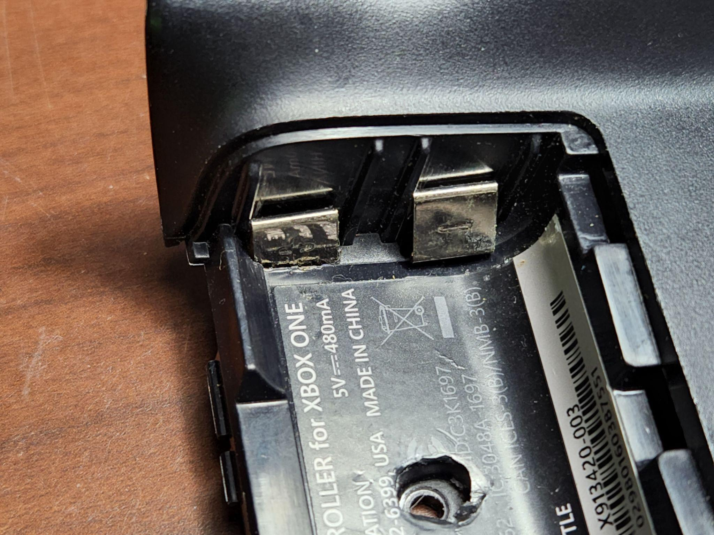
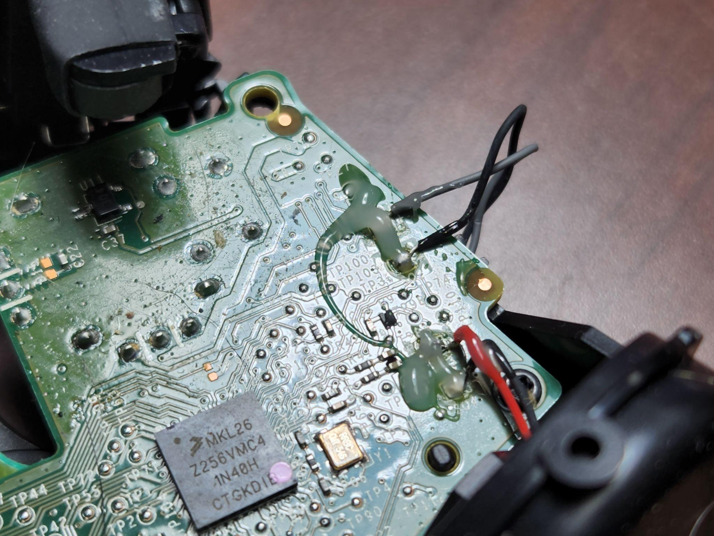

# Full Tear-down

## Prerequisites


Please ensure you have the proper model number for the appropriate shell if you are re-shelling. [See here for the list of each model](./#controller-models)



[See here for recommended tools](./#recommended-tools)


## Tear-Down

### Step 1: Remove the handle plastic

This can be done using a variety of ways, however we have found this way to be the most effective without breaking the plastic locks that secure the plastic to the rest of the rear shell. If the piece you are removing is cosmetically damaged, you can remove it with more force, however be prepared to retrieve the plastic bits that break off.

The area right where the pry tool is and above it are the easiest areas to enter to unlock the plastic locks from the shell (see Fig. XOA). Simply put the pry tool in, or your finger if you’ve had some practice, and use the back of the trigger to provide leverage to pop it directly upwards.

You can also attempt to roll it outward to unlatch the clips that way. Be careful not to pull at an angle that stresses the plastic too much, or to dent/scrape the trigger plastic. If you break the plastic clips, the controller will be unable to lock securely and will feel loose in the hand. If your plastic is broken, you will need to replace that piece (Fig. XOB)

<figure><figcaption>
Fig. XOA
</figcaption></figure>

 

<figure><figcaption>
Fig XOB
</figcaption></figure>

### Step 2: Remove the rear screws, and hidden screw

There are 5 rear T8 screws that must be removed. Use your screwdriver with a T8 Bit.

The first four are along the sides of the handles and the final screw it hidden behind the information sticker (see XOC). You must either tear the sticker out or cut an access hole to open the controller. Organize these screws into their own pile.

<figure><figcaption>
Fig. XOC
</figcaption></figure>

### Step 3: Remove face plate, joystick caps, rear shell + battery terminal

With the rear screws removed, the face plate should lift straight up from the mid-shell (Fig XOD), and you may pull directly up on the joystick caps to remove them. You will then separate and remove the rear plastic from the mid-shell. If it seems to be difficult, check the headphone jack to ensure it is not getting caught on its opening as that is often what prevents you from lifting the back off (Fig XOE). If the back does not come off with little force, DO NOT ATTEMPT TO FORCE IT, something will break eventually if you do that. Check around the shell to see where it is getting stuck.

<figure><figcaption>
Fig. XOD
</figcaption></figure>

 

<figure><figcaption>
Fig. XOD
</figcaption></figure>

To remove the battery contacts, which will be required if you are reshelling, you must use a tool like a set of tweezers to pry the locking tabs from the plastic on the inside of the shell and slide it until it cannot move any further (Fig XOF1). You then must flip it over and press in the battery contacts and slide it through the rest of the way (Fig XOF2).

<figure><figcaption>
Fig. XOF1
</figcaption></figure>

 

<figure><figcaption>
Fig. XOF2
</figcaption></figure>

### Step 4: De-soldering/Re-soldering Rumble Motors

<figure><figcaption>
Fig. XOG
</figcaption></figure>

In Fig XOG, there are 2 pairs of wires: Red/Black, Gray/Black. The black wire is the neutral wire, and the red/gray wires are positive. If you look at the notation on the board, you will see a + or - on the pad (the metal area to which the wires are connected to the board). Neutral goes to -, positive goes to +.

The gray and black wires are for the trigger wiring, the red and black wires are for the rumble motors. This step is essential to work unobstructed within the controller. This is an extremely simple solder job and is great for beginners to learn the basic principles of soldering.&#x20;

The wire should almost instantly come up on its own, or can be moved away from the pad. The pad should solidify quickly after the heat is removed. Remove the motors and organize them with the rest of your parts. The gray and black wires can remain on the mid-shell. Turn off your soldering station when done using.

### Step 5: Removing the rear motherboard and headphone jack

Fig XOH

On the bottom of the outside of the rear board are 2 T6 screws (Fig XOH), unscrew them with your screwdriver and pull straight up on the motherboard to remove it from the front board.

Fig XOI1/2

Ensure that the plastic connectors (Fig XOI1) are not damaged by pulling directly up when uninstalling, or pushing directly down when installing. When installing, be prepared to readjust the headphone jack (Fig XOI2) as it is loose and might move out of place as you are doing this.

### Step 6: Removing the bumper plastic and front board, buttons

Fig XOJ1/2

The front board will not come out easily if the plastic guard is present at the top of the face of the controller. To remove it, insert your pry tool underneath the lip and gently push the plastic away from the midshell (Fig XOJ1). The xbox button commonly gets caught and will prevent you from pulling it out, simply push the button in to clear the lip and remove the plastic the rest of the way (Fig XOJ2). When reinstalling this plastic, there are two plastic legs on the inside that rest on the trigger buttons on the front board. These must be aligned properly or else it will not pop on properly.

Fig XOK

Fig XOL

When removing the plastic, the sync button is also contained by this plastic, be sure to remove it and organize it into your parts, as it can be easily lost or dropped onto the floor. When putting this back together, you will need to slot the leg of the button into the groove cut for it and then slide the plastic over top of it.

FIG XOM

Next we need to remove the D pad from its metal housing. Simply unclip the metal bracket from the bottom pulling outwards and then lift the D pad directly up.

Fig XOM

Remove the 5 T6 screws and pull up on the board to remove it from the midshell. Pull the board directly up to remove it from the midshell. If the board does not easily lift, please check to see if the front plastic has been removed, and that all screws have been removed. If it is still not coming up easily, its possible something sticky has gotten in between the board and plastic, use gentle force to work at it until it is lifted.

Fig XON

There are two white bricks that sit under the triggers, try not to lose these, however they seem to just be sound dampeners and if lost will not impact the function of the controller. There is also a membrane for the buttons inside, remove that and organize that into your parts (Fig XON).

Fig XOO The remainder of the buttons should just pull out and can be organized. Remove the A, B, X, Y, Xbox, Options, Share button from the console. The triggers can remain on the midshell. If you need to replace the midshell, you will need to use a salvage midshell. The trigger plastic can be replaced by removing two Torx screws underneath the triggers and transferred. Teardown complete! You should see everything pictured in Fig XOO (As well as Joystick caps, not pictured here).
