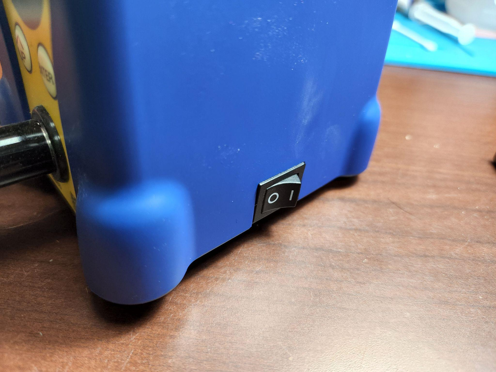

# Soldering Iron Operation

## Preparation

<figure><figcaption>
Fig. SA
</figcaption></figure>

Turn on your soldering station by flipping the switch located on the side or rear depending on your machine (Fig SA), The temperature should optimally be somewhere between 315-343C, but can range from 300-450c.


**NEVER TOUCH THE SOLDERING IRON WHEN THE IRON IS ON WITHIN THE LAST 10 MINUTES AS IT CAN SEVERELY BURN YOU.**


## Tinning the tip

To prepare the iron, we let it heat up all the way, we then brush it in the brass wool, and use solder to apply a thin layer of solder to the tip, then brush it again in the brass wool.&#x20;


This process is called _tinning_ and is important to help solder bond properly to your iron tip.&#x20;

If the tip is oxidized (crusty/rusty looking) it will not absorb solder properly.&#x20;


## Cleaning Up

Before turning off the iron, we need to make sure to [_tin the tip_](soldering-iron-operation.md#tinning-the-tip) of the iron to help prevent a nasty layer of oxidation from forming. Apply a small amount of solder to the tip and make sure it looks nice and shiny for future use.


Most importantly, remember to turn off your soldering iron after use.&#x20;

This is an important habit to develop, it is better for the iron to be turned off then left on.


