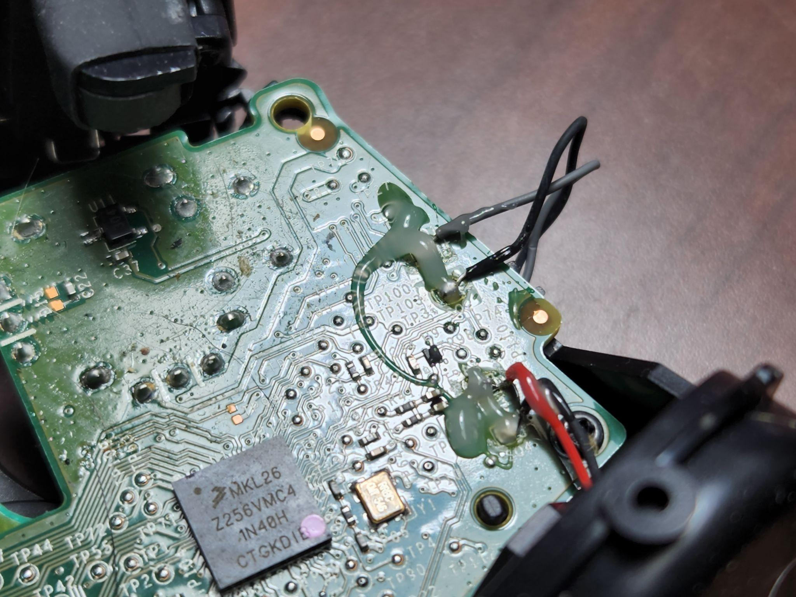

# Wire Soldering

### De-soldering

<figure><figcaption>
Fig. XOG
</figcaption></figure>

You may now touch the tip of the iron to the pad you are working on in order to melt the existing solder.&#x20;


If you find the solder is not melting quickly, try one of two things:

1. Add more solder to the soldering tip
2. Use more surface area of the tip or use a larger tip to create the heat transfer needed.


### Re-soldering


Before re-soldering, ensure the area is clean of debris and flux by using alcohol and a combination of a q tip or brush; be mindful of small components in the area.&#x20;


Begin by heating the pad with the soldering iron until the metal liquefies, then use tweezers to push the wire contact back to the pad, and remove the iron when it is in place, the solder should solidify quickly.&#x20;

If you are having issues, try adding more flux to the area or add some solder to the tip of your iron and touch the pad to transfer some of the solder to the pad, adding more material for the wire to grab.&#x20;
